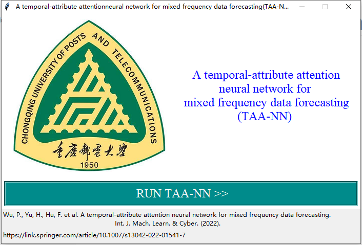
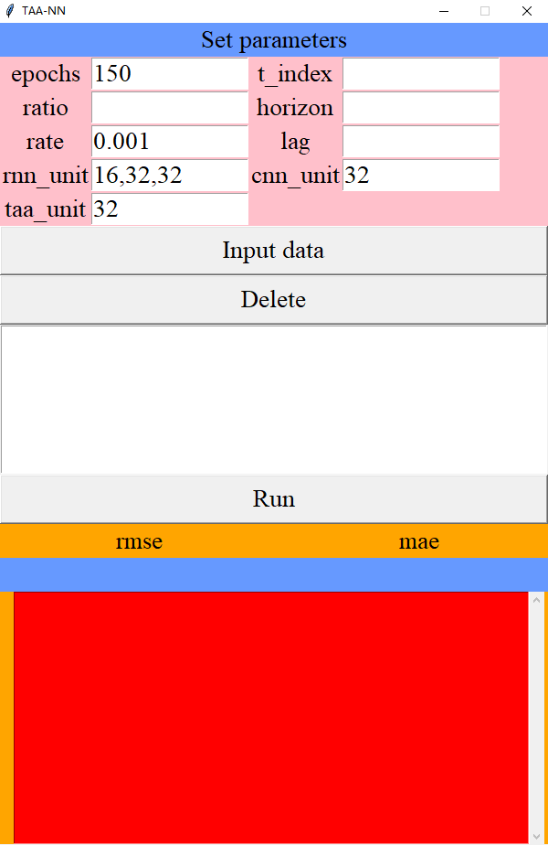
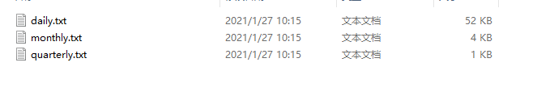
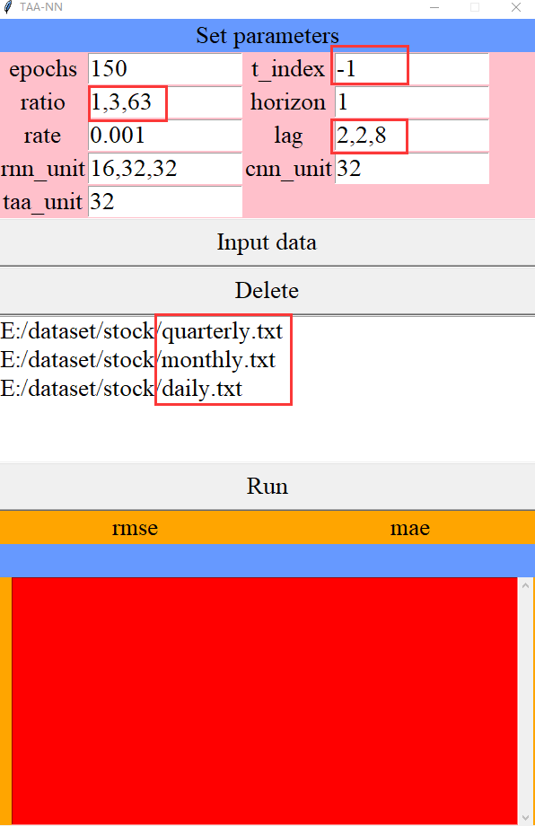
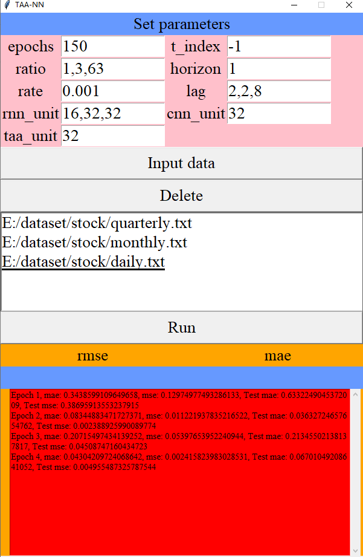

# Introduction

This is navigation window of TAA-NN, including some essential information, such as title, paper link address and reference. Paper link address provide the paper that this software based on. We click “RUN TAA-NN” button to turn into main window of TAA-NN as shown follow.

This window includes 3 parts: parameters setting part, source data inputting part and result shown part. Next we will introduce some details for those 3 parts.

# Set parameter

In the part, we should set last 4 parameters.

- epochs: epochs is set to indicate how many times this training takes repeating. Default=150
- t_index: The index of the predict target file in the list of the input file. eg, 
- ratio: If there are 3 frequency data including daily, monthly and quarterly. Based on those frequency, ratio as “1,21,63”, indicate “day,month,quarter”. 
- horizon: The predict step for the tesk.
- rate: The learning rate of Adam
- lag: The optimal lag of all time series. If there are 3 frequency data, the lag  may be “2,2,8”.
- run_unit: The number of the LSTM unit. If there are 3 frequency data, the run_unit may be “16,32,32”.
- cnn_unit: The number of the cnn unit. 
- taa_unit: The number of the attention layer unit. 

# Input data

In the part, you should open your computer disk to find the input data. There are some rules to limit your input.

1. the order of file opening must according to the frequency order, eg: high frequency file, middle frequency file,low frequency file, or a flashback.

	

	
	
	The information in the red box must correspond one to one.
	
	# Run
	
	After you have finished the appeal operation, you can click the button to run the program.
	
	
	
	After a moment, you can get the result!
	
	
